# Storytelling with Real-Time Illustration Feature

## Overview

This document describes the complete architecture and implementation of our innovative storytelling feature that generates real-time illustrations using AI. When users interact with our ElevenLabs-powered storytelling agent, the system can automatically create beautiful, contextual illustrations that appear instantly on the webpage during the conversation.

## 🎯 Feature Goals

- **Real-time illustration generation** during storytelling conversations
- **Contextual artwork** based on story content, characters, setting, and mood
- **Seamless user experience** with minimal interface
- **Multi-language support** for global accessibility
- **Child-appropriate content** with safety controls

## 🏗️ Architecture Overview

The feature integrates multiple AI services and real-time communication technologies:

### System Components

1. **Frontend (React/TypeScript)**
   - ElevenLabs Conversational AI Widget
   - Server-Sent Events (SSE) client
   - Real-time image display
   - Multi-language interface

2. **Backend (Fastify/Node.js)**
   - Webhook endpoints for ElevenLabs
   - DALL-E API integration
   - SSE server for real-time communication
   - Authentication with Clerk

3. **External Services**
   - **ElevenLabs**: Conversational AI agent
   - **OpenAI DALL-E**: Image generation
   - **ngrok**: Local development tunneling

## 📊 System Flow Diagram

### Complete System Flow

```mermaid
graph TB
    User[👤 User] -->|1. Voice/Text| Widget[🎙️ ElevenLabs Widget]
    Widget -->|2. Conversation| Agent[🤖 ElevenLabs Agent]
    
    Agent -->|3. Tool Call| Webhook[🔗 Webhook Endpoint<br/>/api/images/generate-for-story]
    
    Webhook -->|4. Generate Image| DALLE[🎨 DALL-E API]
    DALLE -->|5. Image URL| Webhook
    
    Webhook -->|6. Broadcast| SSE[📡 SSE Server<br/>/events/story-illustrations]
    SSE -->|7. Real-time Update| Frontend[💻 Frontend]
    
    Frontend -->|8. Display| ImageDisplay[🖼️ Full-Screen Image]
    
    Webhook -->|9. Response| Agent
    Agent -->|10. Confirmation| Widget
    Widget -->|11. Audio Response| User
    
    subgraph "Local Development"
        Ngrok[🌐 ngrok Tunnel] -->|Exposes| Webhook
    end
    
    style User fill:#e1f5fe
    style Agent fill:#f3e5f5
    style DALLE fill:#fff3e0
    style Frontend fill:#e8f5e8
    style Ngrok fill:#fff8e1
```


### Simplified Flow


## 🔧 Technical Implementation

### 1. ElevenLabs Agent Configuration

#### Agent Setup
- **Agent Type**: Conversational AI
- **Model**: Advanced conversation model with tool calling
- **Voice**: Child-friendly voice optimized for storytelling
- **Language Support**: English, Spanish, Chinese, Ukrainian, Romanian

#### Tool Configuration
The agent is configured with a tool that can be called to generate illustrations:

```json
{
  "name": "generate_story_illustration",
  "description": "Creates a beautiful illustration for the current story scene",
  "parameters": {
    "story_content": "The current story content",
    "characters": "Main characters in the scene",
    "setting": "Where the scene takes place",
    "mood": "The emotional tone (happy, magical, adventurous, etc.)",
    "current_scene": "Specific scene to illustrate"
  },
  "webhook_url": "https://your-ngrok-url.ngrok-free.app/api/images/generate-for-story"
}
```

### 2. Backend Webhook Implementation

#### Endpoint: `/api/images/generate-for-story`

```typescript
fastify.post('/generate-for-story', async (request, reply) => {
  try {
    const { story_content, characters, setting, mood, current_scene } = request.body;
    
    // 1. Generate contextual prompt
    const prompt = generateContextualPrompt({
      characters, setting, mood, current_scene
    });
    
    // 2. Call DALL-E API
    const response = await openai.images.generate({
      model: "dall-e-3",
      prompt: prompt,
      size: "1024x1024",
      quality: "standard",
      style: "vivid"
    });
    
    const imageUrl = response.data[0].url;
    
    // 3. Broadcast to frontend via SSE
    const eventData = JSON.stringify({
      type: 'story-illustration',
      data: { imageUrl, context: { story_content, characters, setting, mood, current_scene } }
    });
    
    sseConnections.forEach(connection => {
      connection.write(`data: ${eventData}\n\n`);
    });
    
    // 4. Respond to ElevenLabs
    reply.send({ 
      success: true,
      image_url: imageUrl,
      message: "I've created a beautiful illustration for your story!"
    });
    
  } catch (error) {
    reply.status(500).send({ 
      success: false,
      message: "I'm sorry, I couldn't create the illustration right now."
    });
  }
});
```

#### Smart Prompt Generation

The system generates contextual prompts based on story elements:

```typescript
const generateContextualPrompt = ({ characters, setting, mood, current_scene }) => {
  const baseStyle = "Children's book illustration, cartoon style, vibrant colors, friendly and approachable";
  
  const moodStyles = {
    happy: "bright and cheerful colors, sunny atmosphere, smiling characters",
    magical: "sparkles, glowing effects, enchanted atmosphere, mystical elements",
    adventurous: "dynamic composition, action poses, exciting landscape, bold colors",
    // ... more mood mappings
  };
  
  const characterDesc = characters ? `featuring ${characters}` : 'with charming storybook characters';
  const sceneDesc = current_scene ? `showing ${current_scene}` : 'in an engaging story scene';
  const settingDesc = setting || 'in a magical storybook world';
  const moodStyle = moodStyles[mood] || moodStyles.cheerful;
  
  return `${baseStyle}, ${moodStyle}, set in ${settingDesc}, ${characterDesc}, ${sceneDesc}. 
          Perfect for children ages 4-10, safe and wholesome content, high quality digital art.`;
};
```

### 3. Server-Sent Events (SSE) Implementation

#### SSE Server Setup

```typescript
// SSE endpoint for real-time communication
server.get('/events/story-illustrations', async (request, reply) => {
  reply.raw.writeHead(200, {
    'Content-Type': 'text/event-stream',
    'Cache-Control': 'no-cache',
    'Connection': 'keep-alive',
    'Access-Control-Allow-Origin': '*'
  });

  // Add connection to our set
  sseConnections.add(reply.raw);
  
  // Send initial connection confirmation
  reply.raw.write('data: {"type":"connected"}\n\n');
  
  // Cleanup on disconnect
  reply.raw.on('close', () => {
    sseConnections.delete(reply.raw);
  });
});
```

#### Frontend SSE Client

```typescript
useEffect(() => {
  const eventSource = new EventSource('/events/story-illustrations');
  
  eventSource.onmessage = (event) => {
    const data = JSON.parse(event.data);
    
    if (data.type === 'story-illustration') {
      setGeneratedImage(data.data.imageUrl);
      setStoryImages(prev => [...prev, data.data.imageUrl]);
      
      // Update story context for future illustrations
      if (data.data.context) {
        setStoryContext({
          characters: data.data.context.characters ? [data.data.context.characters] : [],
          setting: data.data.context.setting || 'a magical storybook world',
          currentScene: data.data.context.current_scene || 'an enchanting scene',
          mood: data.data.context.mood || 'cheerful'
        });
      }
    }
  };
  
  return () => eventSource.close();
}, []);
```

### 4. Frontend User Interface

#### Minimal, Full-Screen Design

```typescript
// Clean image display without frames
{generatedImage && (
  <div className="w-full space-y-4">
    <div className="relative w-full">
      
      
      {/* Floating download button */}
      <button
        onClick={() => downloadImage(generatedImage)}
        className="absolute top-4 right-4 bg-white/80 hover:bg-white rounded-full p-2 shadow-md transition-all duration-200 hover:scale-110"
        title="Download Illustration"
      >
        <Download className="h-5 w-5 text-gray-700" />
      </button>
    </div>
  </div>
)}
```

## 🔄 User Experience Flow

### 1. **Story Initiation**
- User opens storytelling session page
- ElevenLabs widget loads with configured agent
- SSE connection establishes for real-time updates

### 2. **Conversation Flow**
- User starts talking to the storytelling agent
- Agent analyzes conversation for illustration opportunities
- Agent asks user: "Would you like me to create a picture of this scene?"

### 3. **Illustration Generation**
- User responds positively ("yes", "sí", "好", "так", "da")
- Agent calls the illustration tool with story context
- Webhook processes the request and generates DALL-E prompt
- OpenAI creates the illustration
- Image broadcasts to frontend via SSE
- User sees the illustration appear instantly

### 4. **Continued Storytelling**
- Agent confirms illustration creation
- Story continues with new illustrations as needed
- All images remain visible and downloadable

## 🌐 Development Setup

### Prerequisites

1. **Environment Variables**
```bash
# Backend (.env)
ELEVENLABS_API_KEY=your_elevenlabs_key
OPENAI_API_KEY=your_openai_key
CLERK_SECRET_KEY=your_clerk_secret
PORT=3000

# Frontend (.env)
VITE_CLERK_PUBLISHABLE_KEY=your_clerk_publishable_key
```

2. **ngrok Setup**
```bash
# Install ngrok
npm install -g ngrok

# Start ngrok tunnel (in separate terminal)
ngrok http 3000

# Note the https URL for webhook configuration
# Example: https://abc123.ngrok-free.app
```

### Local Development Workflow

1. **Start Backend**
```bash
cd backend
npm run dev
```

2. **Start Frontend**
```bash
cd frontend  
npm run dev
```

3. **Start ngrok Tunnel**
```bash
ngrok http 3000
```

4. **Configure ElevenLabs Webhook**
- Copy ngrok HTTPS URL
- Update ElevenLabs agent tool webhook URL to:
  `https://your-ngrok-url.ngrok-free.app/api/images/generate-for-story`

## 🚀 Production Deployment

### Critical Changes for Production

1. **Update Webhook URLs**
   - Replace ngrok URL with production domain
   - Update ElevenLabs agent configuration
   - Example: `https://yourapp.com/api/images/generate-for-story`

2. **Environment Configuration**
```bash
# Production environment variables
ELEVENLABS_API_KEY=prod_key
OPENAI_API_KEY=prod_key
FRONTEND_URL=https://yourapp.com
```

3. **SSL/HTTPS Requirements**
   - ElevenLabs requires HTTPS for webhooks
   - Ensure production server has valid SSL certificate

4. **Rate Limiting & Security**
   - Implement rate limiting for webhook endpoints
   - Add webhook signature verification
   - Monitor DALL-E API usage and costs

## 🔍 Troubleshooting

### Common Issues

#### 1. **Images Not Appearing**
- **Check SSE Connection**: Look for green "ready" indicator
- **Verify Webhook URL**: Ensure ngrok URL is current in ElevenLabs
- **Console Errors**: Check browser dev tools for connection issues

#### 2. **Webhook Not Triggered**
- **Test Endpoint**: Visit `/webhook/test` to verify connectivity
- **Agent Configuration**: Ensure tool is properly configured
- **ngrok Status**: Verify ngrok tunnel is active

#### 3. **Image Generation Fails**
- **OpenAI API Key**: Check credentials and quota
- **Prompt Length**: Ensure prompts aren't too long
- **Content Policy**: Verify prompts meet OpenAI guidelines

### Debugging Tools

#### SSE Connection Test
```javascript
// Test SSE connection in browser console
const eventSource = new EventSource('/events/story-illustrations');
eventSource.onmessage = (event) => console.log('SSE:', event.data);
```

#### Webhook Test
```bash
# Test webhook endpoint directly
curl -X POST https://your-ngrok-url.ngrok-free.app/api/images/generate-for-story \
  -H "Content-Type: application/json" \
  -d '{"story_content":"A dragon in a castle","mood":"magical"}'
```

## 📊 Performance Considerations

### Image Generation Times
- **DALL-E 3**: ~10-15 seconds average
- **Network latency**: 1-3 seconds
- **Total user wait**: 12-18 seconds typical

### Optimization Strategies
- **Streaming responses**: SSE provides immediate feedback
- **Caching**: Consider caching similar prompts
- **Fallback handling**: Graceful degradation on API failures

## 🔐 Security & Safety

### Content Safety
- **Child-appropriate prompts**: All prompts include safety guidelines
- **OpenAI moderation**: Automatic content filtering
- **Age-appropriate themes**: Stories designed for ages 4-10

### Data Privacy
- **No story storage**: Stories aren't persisted on our servers
- **Image URLs**: DALL-E URLs expire automatically
- **User data**: Minimal data collection, GDPR compliant

## 📈 Future Enhancements

### Potential Improvements
1. **Image Styles**: Multiple art styles (watercolor, pencil, etc.)
2. **Character Consistency**: Maintain character appearance across scenes
3. **Story Branching**: Interactive story choices with illustrations
4. **Animation**: Subtle animations for scene transitions
5. **Collaborative Stories**: Multi-user storytelling sessions

### Technical Roadmap
1. **Caching Layer**: Redis for prompt/image caching
2. **CDN Integration**: Faster image delivery
3. **Webhook Security**: Signature verification
4. **Analytics**: Usage tracking and optimization
5. **A/B Testing**: Different illustration styles

## 📝 Code Locations

### Key Files
```
backend/
├── src/
│   ├── index.ts              # Main server, SSE setup
│   └── routes/
│       └── images.ts         # Webhook endpoint, DALL-E integration

frontend/
├── src/
│   ├── pages/services/
│   │   └── StorytellingSession.tsx  # Main UI component
│   ├── services/
│   │   └── SpanishTranslations.ts   # Localization
│   └── config/
│       └── agentConfig.ts    # ElevenLabs configuration
```

## 🎉 Conclusion

This storytelling with illustration feature represents a sophisticated integration of multiple AI services, real-time communication, and modern web technologies. The architecture provides a seamless user experience where stories come to life with beautiful, contextual illustrations generated in real-time.

The modular design allows for easy maintenance and future enhancements, while the comprehensive error handling and fallback mechanisms ensure reliability in production environments.

---

*Last Updated: December 2024*  
*Author: Development Team*  
*Version: 1.0* 